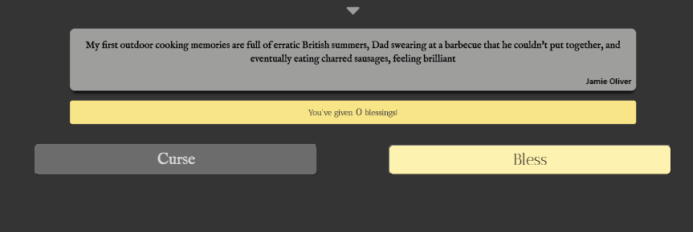

# Capstone 3 : Cursr

Cursr is an online venting service with a focus on anonymity. 

Developed by: 
[Adam Brown](https://github.com/ChancellorAceX),
[Brian Charles](https://github.com/bcharles41078),
[Keith Freitag](https://github.com/keithmoo),
[Orkun Ozekin](https://github.com/orkunozekin), and 
[Thomas Davis](https://github.com/thomasDavisA)

TA Handler:
[Mike Stowe](https://github.com/mikeStowe)

## How It Works

On Cursr, you can create an account and log in or you can use some of the functionality as a guest.

### Curse
The main function is to **Curse**, which can be done anonymously if desired.  When you **Curse**, you can 
scream out your frustrations or anything desired without regard to social constraints, which can be 
cathartic.  When you **Curse**, only one other person in the world will be able to see it, and they 
will not see who sent it.  If desired, they can use the other main function of Cursr: *Bless*.  This 
is where they read the Curse and stamp a unicode character to it.

As a **Curser**, you do not need to worry about hearing any kind of judgement or anything from the 
*Blesser*; the only thing you will see is that your **Curse** has been read and emblazoned with a 
unicode character.

### Bless
*Blessing* can only be done by a logged in user, and only 3 per 3 hour period.  As a *Blesser*, you are 
gazing into the abyss to see people's frustrations and who knows what else.  Even though a *Blesser* 
knows that they are gazing upon **Curses** that are too spicy to see the light of normal social interaction, 
the *Blesser* does have the option to mute a Curser and will no longer have their **Curses** delivered to 
them when they decide to *Bless* again.