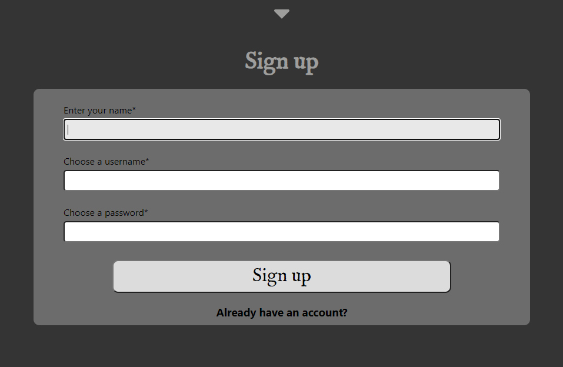
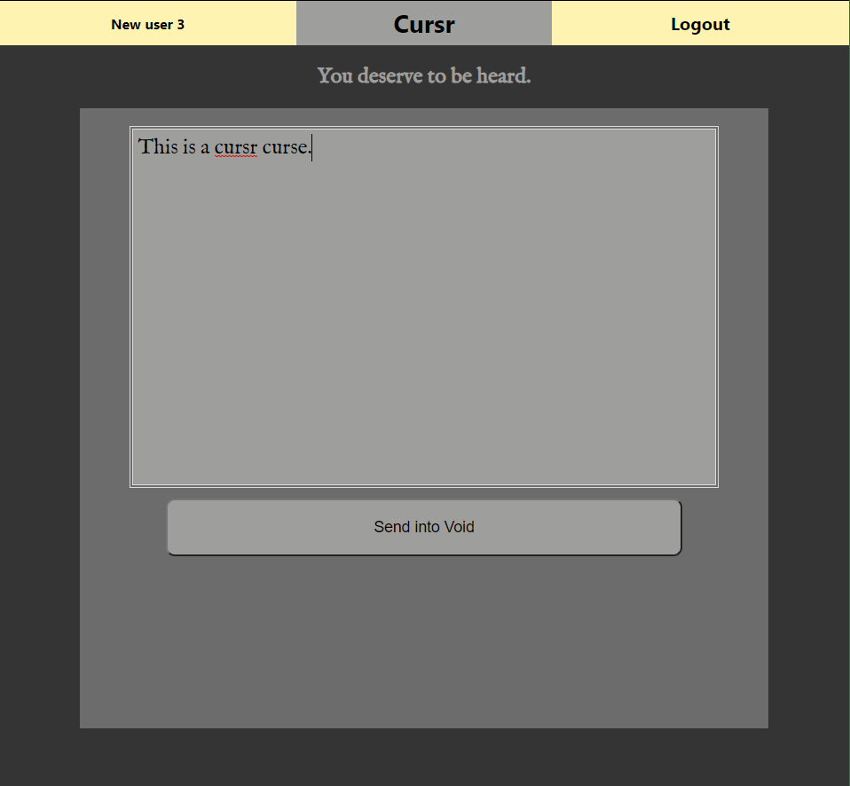
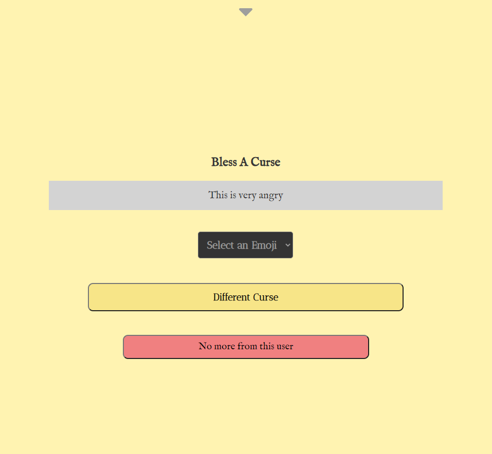

# Capstone 3 : Cursr
- Live link: https://capstone-3-oabkt.vercel.app/
- Server Repo: https://github.com/thinkful-ei-orka/Capstone-3-O-K-A-B-T-Server

Cursr is an online venting service with a focus on anonymity. 

Developed by: 
[Adam Brown](https://github.com/ChancellorAceX),
[Brian Charles](https://github.com/bcharles41078),
[Keith Freitag](https://github.com/keithmoo),
[Orkun Ozekin](https://github.com/orkunozekin), and 
[Thomas Davis](https://github.com/thomasDavisA)

TA Handler:
[Mike Stowe](https://github.com/mikeStowe)

### Demo Credentials
Username | Password
------------ | -------------
DemoUser | DemoUser*2
demo | Demodemo1!

## How It Works

On Cursr, you can create an account and log in or you can use some of the functionality as a guest.

### Curse
The main function is to **Curse**, which can be done anonymously if desired.  When you **Curse**, you can 
scream out your frustrations or anything desired without regard to social constraints, which can be 
cathartic.  When you **Curse**, only one other person in the world will be able to see it, and they 
will not see who sent it.  If desired, they can use the other main function of Cursr: *Bless*.  This 
is where they read the Curse and stamp a unicode character to it.

As a **Curser**, you do not need to worry about hearing any kind of judgement or anything from the 
*Blesser*; the only thing you will see is that your **Curse** has been read and emblazoned with a 
unicode character.

### Bless
*Blessing* can only be done by a logged in user, and only 3 per day.  As a *Blesser*, you are 
gazing into the abyss to see people's frustrations and who knows what else.  Even though a *Blesser* 
knows that they are gazing upon **Curses** that are too spicy to see the light of normal social interaction, 
the *Blesser* does have the option to mute a Curser and will no longer have their **Curses** delivered to 
them when they decide to *Bless* again.

## Technologies Used
Front end:
  - React
  - JavaScript
  - HTML 5
  - CSS 3

Back end:
  - JavaScript
  - Express
  - Node.js  

# API Documentation:
# Curse App API
##### https://warm-garden-23848.herokuapp.com/

## BlessCurse has 5 API endpoints:
- /api/auth/token
- /api/user
- /api/blessings
- /api/curses
- /api/quotes

### Authorization - '/api/auth/token'
---
#### POST
  - Parameters
    - username
    - password
  - Returns
    - If the username and password both match an existing user, an auth token is provided
---
---
### User - '/api/user'
---
#### POST
  - Parameters
    - name
    - username 
      - Must be unique
    - password
      - Must be more than 7 characters
      - Must be less than 72 characters
      - Must not start or end with a space
      - Must have an upper case letter
      - Must have a lower case letter
      - Must have a number
      - Must have a special character
  - Returns
    - Creates a new account on the database and returns the created user

#### GET - Authorization required
  - Parameters
    - none
  - Returns
    - The current user's data
    - All blessed curses that belong to that user

#### PATCH - Authorization required
  - Parameters
    - curse_id - the curse_id belonging to the user you wish to block
  - Returns
    - Adds the owner of the curse to be added to the current user's blocklist. No curses from that user will be displayed to the current user thereafter
---
---
### Blessings - '/api/blessings' 
---
#### GET
  - Parameters
    - None
  - Returns
    - All blessings and blessing_ids in an array
---
---
### Curses - '/api/curses'
---
#### GET - Requires authorization
  - Parameters
    - None
  - Returns
    - If available curses exist for the user
      - A random curse from the pool of available curses is provided to the user
      - Available curses are curses that
        - Do not belong to the current user
        - Do not belong to any of the users on the current user's blocklist
        - Have not being previously pulled or blessed by any user
    - If no curses exist for the user
      - 'No available curses'
#### POST
  - Parameters
    - curse
      - A curse message cannot
        - Be empty
        - Be less than 10 characters
        - Be less than 4 words
        - Be more than 400 characters
  - Returns
    - Adds the curse to the database
    - Send a message and submitted information to the user as an object
      - If logged in
        - user: username
        - curse: curse sent to the database
        - message: 'Curse sent as (username)'
      - If not logged in
        - user: null
        - curse: curse sent to the database
        - message: 'Curse sent anonymously'
#### PATCH - Requires authorization
  - Parameters
    - blessing_id - the blessing to apply to the curse
    - curse_id - the curse to be blessed
  - Returns
    - Blesses the curse within the database and assigns the desired blessing to it
    - Message: 'Curse blessed with blessing (blessing_id)'
#### DELETE - Requires authorization
  - Parameters
    - curse_id - the curse_id of the curse to be blessed
  - Returns
    - The authorized user must be the owner of the curse being deleted
    - If owner, returns an object
      - {deletedCurse: (all curse data)}
    - If not owner
      - 'User is not the owner of the provided curse'
---
---
### Quotes - '/api/quotes'
---
#### GET - Requires authorization
  - Parameters
    - None
  - Returns
    - A random quote from the database table
    - The quote will include the quote and the source as an object: {quote, source}
